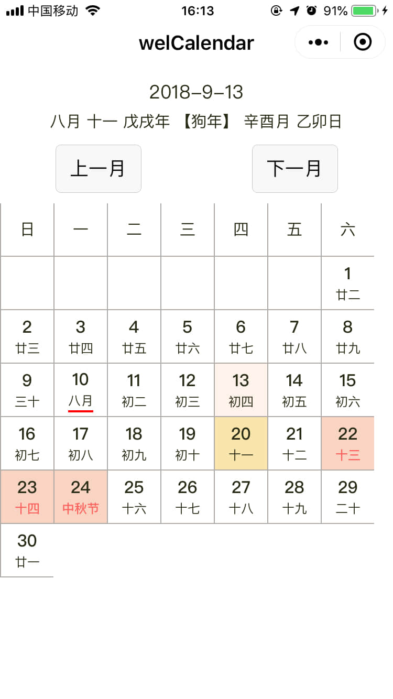

# welCalendar
微信小程序日历（带农历）

## 声明

计算农历的代码逻辑来自于[overtrue/chinese-calendar](https://github.com/overtrue/chinese-calendar)，我只是将其中的`PHP`代码转为了`javascript`上能使用的版本。并且目前只保证`Calendar.js`中的`Calendar.solar(year, month, day)`方法能够正常使用。

据上面repo的文档介绍，农历计算范围为1900年至2100年公历。

## 截图

